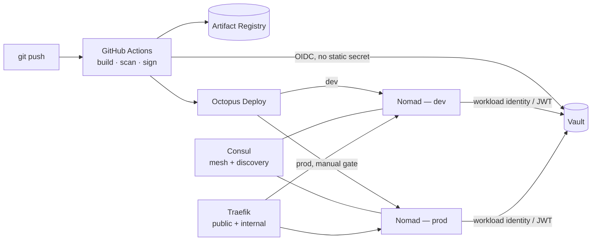

# Nomad Platform on GCP

A workload orchestration platform for running containerized workloads on Google Cloud.

Nomad handles workload orchestration, Consul provides service discovery and service mesh, and Vault manages secrets, workload identity, and dynamic credentials. These three components form the platform's core runtime layer.

Supporting components handle infrastructure provisioning and configuration with Terraform and Ansible, machine image building with Packer, ingress and load balancing with Traefik, and application delivery with Octopus Deploy.

The platform also provides dynamic database credentials, autoscaling, observability, internal and public ingress, PKI and mTLS, runtime security, and backup and restore.

Google's Online Boutique runs as the reference workload, alongside two custom monitoring services built for the platform: `nomad-sentinel` (AI-assisted allocation health analysis and Slack reporting) and `metrics-api` (metrics collection and exposure). Together they exercise the platform's service mesh, discovery, secrets, autoscaling, observability, and deployment flow.

## Platform components

- **Service mesh & discovery** — Consul Connect with deny-by-default intentions and Consul Catalog service discovery.
- **Secrets** — Vault with Workload Identity/JWT authentication and dynamic database credentials.
- **Autoscaling** — Nomad Autoscaler for on-demand and spot node pools, using Prometheus metrics.
- **Observability** — Prometheus, Loki, Grafana Alloy, and Grafana.
- **CD** — Octopus Deploy with dev → prod promotion and a manual production approval gate.
- **PKI** — three self-signed CAs with per-environment certificates and mTLS for Nomad and Consul.
- **Runtime security and backups** — Falco on Nomad clients and automated backups for Vault, Consul, Postgres, and Octopus.

Add workloads under `nomad-jobs/<namespace>/` and configure the required Consul intentions, Vault access, CI configuration, and deployment project. See [`docs/architecture.md`](docs/architecture.md) for the platform design.

## Stack at a glance

| | |
|---|---|
| **Orchestrator** | Nomad (Community Edition) — dev + prod environments, shared management plane |
| **Service mesh** | Consul Connect, deny-by-default intentions |
| **Secrets** | Vault — Workload Identity/JWT auth, dynamic Postgres credentials, no static app tokens |
| **CI** | GitHub Actions, self-hosted runner, OIDC straight into Vault (no long-lived GitHub secrets) |
| **CD** | Octopus Deploy (self-hosted) — 5 projects, dev → prod promotion with a manual approval gate |
| **Ingress** | Traefik — 3 VMs, 5 routed instances (public dev, public prod, internal ×3 for mgmt/dev/prod), ACME via Cloudflare DNS-01 (internal) + HTTP-01 (public) |
| **PKI** | Self-signed — 3 CAs, per-environment leaf certs, mTLS between every Nomad/Consul agent |
| **IaC** | Terraform (5 layers) + Ansible (10 roles) + Packer (server *and* client images) |
| **Ops** | Automated daily backups (Vault, Consul, Postgres, Octopus) + a written restore runbook per component |
| **Runtime security** | Falco with 5 custom rules, alerts routed to Loki and escalated to `nomad-sentinel` |
| **Workload** | Online Boutique (11 services) + `metrics-api` + `nomad-sentinel` — reference workload |
| **Namespaces** | `boutique`, `datastore`, `monitoring`, `security`, `operations`, `plugins` |

## Architecture



See [`docs/architecture.md`](docs/architecture.md).

## Repo layout

```
.
├── .github/          # CI: composite actions, config-driven build/deploy workflows
├── ansible/           # Config management — 10 roles, Taskfile-orchestrated
├── docs/              # This documentation
├── local/             # Docker Compose — local dev/test only, not the deployment path
├── monitoring/        # metrics-api, nomad-sentinel, Grafana, Loki, Alloy, Falco webhook
├── nomad-jobs/        # All Nomad job specs, one directory per namespace
├── octopus/           # Octopus worker image + deployment scripts
├── packer/            # Nomad server/client golden image template
├── scripts/           # PKI generation, backup/restore, bootstrap helpers
├── services/          # Vendored Online Boutique microservices
└── terraform/         # bootstrap → network → compute → platform-config
```

## Standing it up

The platform is deployed in dependency order:

1. **`terraform/bootstrap`** — project-wide primitives: APIs, KMS, GCS state/artifact buckets, Artifact Registry, service accounts (including `packer-builder-sa`). Applied once.
2. **`terraform/network`** — the VPC, dev/prod/mgmt subnets, firewall rules, Cloud DNS. Packer's build VM lives on `subnet-mgmt`, so this has to exist before step 3.
3. **`packer build`** — `terraform/compute` sets `boot_disk_image` to the `nomad-client`/`nomad-server` image families directly; those families don't exist until Packer creates them, and `compute` will fail outright without this step first:
   ```bash
   cd packer && packer init .
   packer build -var-file="nomad-server.pkrvars.hcl" .
   packer build -var-file="nomad-client.pkrvars.hcl" .
   ```
   One shared template and two variable files, each pointing to an Ansible playbook (`nomad-servers.yaml` / `nomad-clients.yaml`) — see [`packer/README.md`](packer/README.md). Per-environment values (certificates, gossip keys, and datacenter) are not baked into the images; they're fetched at boot, which is why this step has no dependency on PKI existing yet.
4. **`scripts/generate-and-push-pki.sh`** — generates the three CAs and every leaf cert/gossip key, pushes them to Secret Manager. Must run before step 5's instances actually boot — every startup script fetches its TLS material from Secret Manager with nothing to fall back to.
5. **`terraform/compute`** — creates the real VMs/MIGs from the images built in step 3. Instances boot, run their startup scripts, and fetch the PKI material from step 4.
6. **Ansible, one step at a time** 
   ```bash
   cd ansible
   task install                       # collections + control-node deps
   task mgmt                          # Vault, Octopus, GitHub runner, backup timers — mgmt-vm
   task vault-init                    # one-time Vault operator init (after mgmt succeeds)
   task nomad-servers ENV=dev         # repeat with ENV=prod
   task consul-acl-bootstrap ENV=dev  # repeat with ENV=prod — must precede step 7
   task nomad-acl-bootstrap ENV=dev   # repeat with ENV=prod — must precede step 7
   task nomad-clients
   task traefik-internal
   task traefik-public ENV=dev        # repeat with ENV=prod
   task grafana
   ```
   `task bootstrap-all` runs the same sequence unattended. See [`ansible/Taskfile.yaml`](ansible/Taskfile.yaml) for the task definitions.
7. **`terraform/platform-config`** (`mgmt` → `dev` → `prod`) — Vault engines/policies, Consul/Nomad ACL tokens, Octopus projects and environments. Needs the operator tokens step 6 produced.
8. **`nomad-jobs/plugins/deploy-plugins.sh`** — CSI plugin and Autoscaler, deployed directly (outside Octopus, since these are cluster infrastructure with no real release lifecycle).
9. Pushes to `main` trigger GitHub Actions. Octopus deploys to dev automatically and to prod after the manual approval gate.

## Bringing your own workload

The platform doesn't care what's running on it — Online Boutique just proves it works. To add your own service:

1. Drop a job spec in `nomad-jobs/<namespace>/` (pick the namespace that fits, or add one).
2. Add it to `local.intentions` in `terraform/modules/consul/locals.tf` if it needs to talk to another mesh service — deny-by-default means nothing connects until it's listed.
3. Give it a Vault policy by adding an entry to `platform-config`'s `vault_consumers` map — the JWT role and KV/database access get derived from that automatically.
4. Add it to the matching `.github/configs/*.json` so CI picks it up, and give it an Octopus project (or fold it into an existing one) for deployment.


## Documentation

| Doc | Covers |
|---|---|
| [`docs/architecture.md`](docs/architecture.md) | Every layer, with diagrams, and why it's built the way it is |
| [`docs/security.md`](docs/security.md) | PKI/mTLS, IAM, secrets tiering, ACL model, supply chain, known limitations |
| [`docs/ci-cd.md`](docs/ci-cd.md) | The build → scan → sign → release → deploy pipeline in full |
| [`docs/CHANGELOG.md`](docs/CHANGELOG.md) | Major redesigns, real bugs fixed, and what's deliberately not implemented |

## License

MIT — see [`LICENSE`](LICENSE).
