# Nomad Platform on GCP

A workload orchestration platform for running containerized workloads on Google Cloud.

Nomad handles workload orchestration, Consul provides service discovery and service mesh, and Vault manages secrets, workload identity, and dynamic credentials. These three components form the platform's core runtime layer.

Supporting components handle infrastructure provisioning and configuration with Terraform and Ansible, machine image building with Packer, ingress and load balancing with Traefik, and application delivery with Octopus Deploy.

The platform also provides dynamic database credentials, autoscaling, observability, internal and public ingress, PKI and mTLS, runtime security, and backup and restore.

Google's Online Boutique runs as the reference workload, alongside two custom monitoring services built for the platform: `nomad-sentinel` (AI-assisted allocation health analysis and Slack reporting) and `metrics-api` (metrics collection and exposure). Together they exercise the platform's service mesh, discovery, secrets, autoscaling, observability, and deployment flow.


*Platform Architecture.*

## Table of Contents

- [Platform Components](#platform-components)
- [Repository Structure](#repository-structure)
- [Getting Started](#getting-started)
  - [1. Bootstrap](#1-bootstrap)
  - [2. Network](#2-network)
  - [3. Build Machine Images](#3-build-machine-images)
  - [4. Generate and Push PKI](#4-generate-and-push-pki)
  - [5. Provision Compute](#5-provision-compute)
  - [6. Configure with Ansible](#6-configure-with-ansible)
  - [7. Configure Core Platform Runtime Services](#7-configure-core-platform-runtime-services)
  - [8. Deploy Cluster Plugins](#8-deploy-cluster-plugins)
  - [9. Deploy Workloads](#9-deploy-workloads)
- [Bringing Your Own Workload](#bringing-your-own-workload)
- [Documentation](#documentation)
- [License](#license)

## Platform components

| Component                    | Implementation                                                                                                       |
| ---------------------------- | -------------------------------------------------------------------------------------------------------------------- |
| **Orchestrator**             | Nomad - dev and prod clusters                                                                                        |
| **Service mesh & discovery** | Consul Connect with service intentions, Consul Catalog                                                               |
| **Secrets**                  | Vault - Workload Identity/JWT auth, dynamic Postgres credentials, GCP secrets backend                                |
| **Autoscaling**              | Nomad Autoscaler - on-demand and spot node pools, driven by Prometheus metrics                                       |
| **CI**                       | GitHub Actions, self-hosted runner                                                                                   |
| **CD**                       | Octopus Deploy (self-hosted)                                                                                         |
| **Ingress**                  | Traefik - 3 VMs, 5 routed instances (public dev, public prod, internal mgmt/dev/prod)                                |
| **PKI**                      | Self-signed, 3 CAs, per-environment leaf certs, mTLS between Nomad/Consul agents                                     |
| **IaC**                      | Terraform, Ansible, Packer (server and client images)                                                                |
| **Observability**            | Prometheus, Loki, Grafana Alloy, Grafana, `nomad-sentinel` (AI-assisted monitoring)                                  |
| **Runtime security**         | Falco with custom rules on Nomad clients, alerts routed to `falco-webhook` service and escalated to `nomad-sentinel` |
| **Backups & recovery**       | Automated daily backups for Vault, Nomad, Consul, Postgres, Octopus MSSQL, with per-component restore scripts        |

## Repo layout

```text
.
├── .github/          # CI: composite actions, config-driven build/deploy workflows
├── ansible/          # Config management - 10 roles, Taskfile-orchestrated
├── docs/             # Documentation
├── local/            # Docker Compose and scripts - local dev/test only
├── monitoring/       # Grafana, Loki, Alloy, Falco webhook, metrics-api, nomad-sentinel
├── nomad-jobs/       # All Nomad job specs, one directory per namespace
├── octopus/          # Octopus worker image + deployment scripts
├── packer/           # Nomad server/client golden image template
├── scripts/          # PKI generation, backup/restore, bootstrap helpers
├── services/         # Google Online Boutique microservices
└── terraform/        # bootstrap → network → compute → platform-config
```

## Getting Started

The platform is deployed in dependency order:

### 1. Bootstrap

**`terraform/bootstrap`** - project-wide primitives: APIs, KMS, GCS state/artifact buckets, Artifact Registry, service accounts (including `packer-builder-sa`). Applied once.

### 2. Network

**`terraform/network`** - the VPC, dev/prod/mgmt subnets, firewall rules, Cloud DNS. Packer's build VM lives on `subnet-mgmt`, so this has to exist before step 3.

### 3. Build machine images

**`packer build`** - `terraform/compute` sets `boot_disk_image` to the `nomad-client`/`nomad-server` image families directly; those families don't exist until Packer creates them, and `compute` will fail outright without this step first:

```bash
cd packer && packer init .
packer build -var-file="nomad-server.pkrvars.hcl" .
packer build -var-file="nomad-client.pkrvars.hcl" .
```

One shared template and two variable files, each pointing to an Ansible playbook (`nomad-servers.yaml` / `nomad-clients.yaml`) - see [`packer/README.md`](packer/README.md).

Per-environment values (certificates, gossip keys, and datacenter) are not baked into the images; they're fetched at boot, which is why this step has no dependency on PKI existing yet.

### 4. Generate and push PKI

**`scripts/generate-and-push-pki.sh`** - generates the three CAs and every leaf cert/gossip key, pushes them to Secret Manager.

This must run before step 5's instances actually boot - every startup script fetches its TLS material from Secret Manager with nothing to fall back to.

### 5. Provision compute

**`terraform/compute`** - creates the real VMs/MIGs from the images built in step 3. Instances boot, run their startup scripts, and fetch the PKI material from step 4.

### 6. Configure with Ansible

Run Ansible one step at a time:

```bash
cd ansible

task install                       # collections + control-node deps
task mgmt                          # Vault, Octopus, GitHub runner, backup timers - mgmt-vm
task vault-init                    # one-time Vault operator init (after mgmt succeeds)
task consul-acl-bootstrap ENV=dev  # repeat with ENV=prod - must precede step 7
task nomad-acl-bootstrap ENV=dev   # repeat with ENV=prod - must precede step 7
task traefik-internal
task traefik-public ENV=dev        # repeat with ENV=prod
task grafana
```

`task bootstrap-all` runs the same sequence unattended. See [`ansible/Taskfile.yaml`](ansible/Taskfile.yaml) for the task definitions.

### 7. Configure core platform runtime services

**`terraform/platform-config`** (`mgmt` → `dev` → `prod`) - Vault engines/policies, Consul/Nomad ACL tokens, Octopus projects and environments.

This needs the operator tokens produced in step 6.

### 8. Deploy cluster plugins

**`nomad-jobs/plugins/deploy-plugins.sh`** - CSI plugin and Autoscaler, deployed directly outside Octopus because these are cluster infrastructure with no real release lifecycle.

### 9. Deploy workloads

Pushes to `main` trigger GitHub Actions. Octopus deploys to dev automatically. The build is promoted to prod after the manual approval gate.

## Bringing your own workload

The platform doesn't care what's running on it - Online Boutique just proves it works. To add your own service:

1. Drop a job spec in `nomad-jobs/<namespace>/` (pick the namespace that fits, or add one).
2. If the job requires a new namespace, add the namespace to `local.intentions` in `terraform/modules/nomad/locals.tf` before apply.
3. Add it to `local.intentions` in `terraform/modules/consul/locals.tf` if it needs to talk to another mesh service - deny-by-default means nothing connects until it's listed.
4. Give it a Vault policy by adding an entry to `platform-config`'s `vault_consumers` map - the JWT role and KV/database access get derived from that automatically.
5. Add it to the matching `.github/configs/*.json` so CI picks it up, and give it an Octopus project (or fold it into an existing one) for deployment.

## Documentation

| Doc                                            | Covers                                                                     |
| ---------------------------------------------- | -------------------------------------------------------------------------- |
| [`docs/architecture.md`](docs/architecture.md) | Every layer, with diagrams, and why it's built the way it is               |
| [`docs/security.md`](docs/security.md)         | PKI/mTLS, IAM, secrets tiering, ACL model, supply chain, known limitations |
| [`docs/ci-cd.md`](docs/ci-cd.md)               | The build → scan → sign → release → deploy pipeline in full                |
| [`docs/CHANGELOG.md`](docs/CHANGELOG.md)       | Major redesigns, real bugs fixed, and what's deliberately not implemented  |

## License

MIT - see [`LICENSE`](LICENSE).
